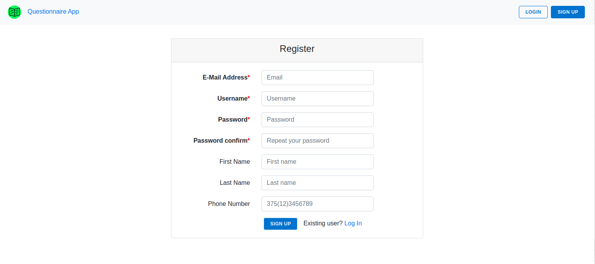
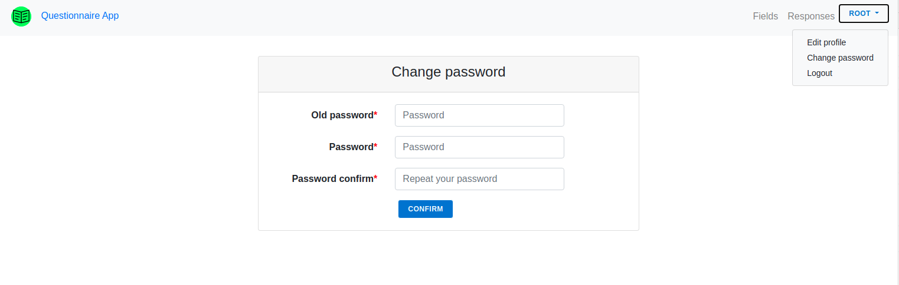
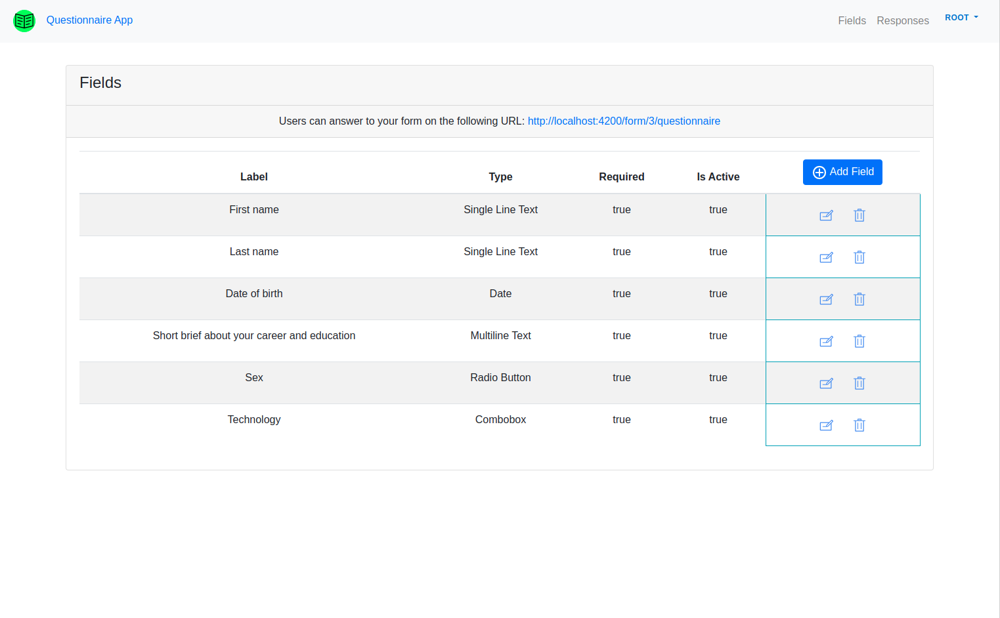
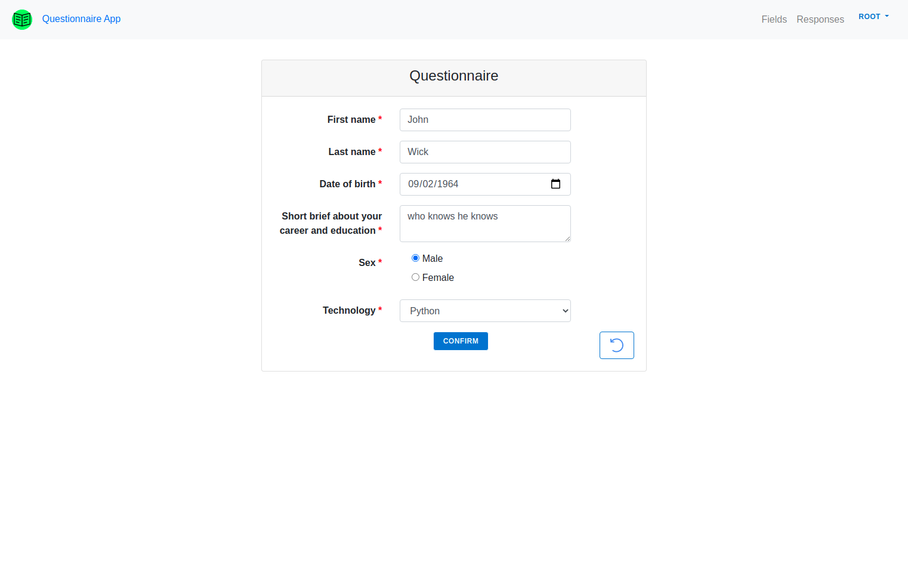
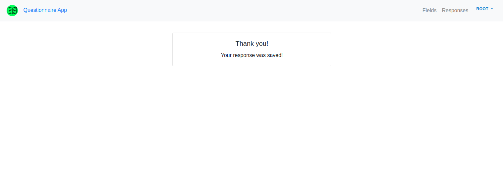
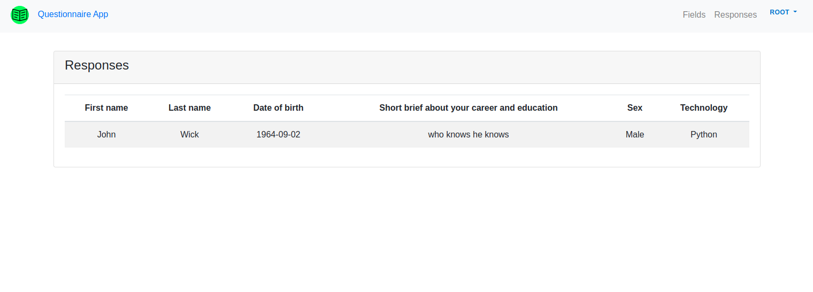

# QuestionnaireApp

App is designed to create questionnaires, answer them and display the responses.

Backed API: [Github](https://github.com/unvisiblee/questionnaireApp)

##Sign up page

##Change password page

##Fields page

##Questionnaire page

## Success page

## Responses page
This page uses the Websocket protocol. Response list is updated in real time

